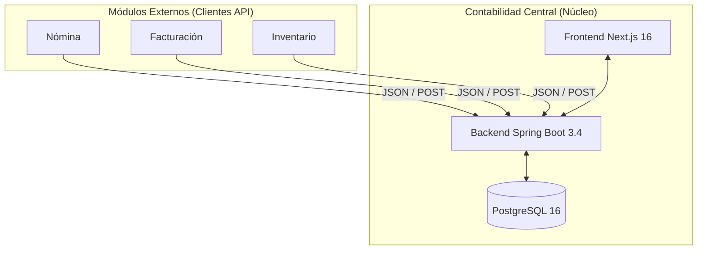

# 🏛️ Arquitectura del Sistema

Esta sección describe la vista de alto nivel de **Contabilidad Central UNAPEC**, su infraestructura y cómo interactúa con módulos externos.

---

## 🏗️ Diagrama de Contexto (C4 Model)

El sistema actúa como el núcleo central para la consolidación financiera de la organización.

---

## 🛠️ Stack Tecnológico Detallado

### **Capa de Aplicación (Backend)**
*   **Java 21**: Aprovechando *Virtual Threads* y *Records* para mayor eficiencia en procesos de integración.
*   **Spring Boot 3.4**: Configurado con *Spring Web*, *Spring Data JPA* y *Validation API*.
*   **Lombok**: Para reducir el código *boilerplate*.
*   **SpringDoc OpenAPI**: Generación automática de especificación Swagger en `/swagger-ui.html`.

### **Capa de Usuario (Frontend)**
*   **Next.js 16 (App Router)**: Renderizado híbrido (SSR/Client Components) para un dashboard veloz.
*   **Tailwind CSS**: Estética minimalista inspirada en el diseño industrial de Apple.
*   **Lucide React**: Set de iconos coherente y liviano.

### **Persistencia (Base de Datos)**
*   **PostgreSQL 16**: Base de datos relacional robusta.
*   **Hibernate (JPA)**: Configurado con `ddl-auto=update` para sincronización automática del esquema.

---

## 🔄 Flujo de Datos

1.  **Ingesta**: Un módulo externo envía un `POST` con un arreglo de movimientos (Debe y Haber).
2.  **Validación**: El Backend verifica que el asiento esté "cuadrado" antes de persistir.
3.  **Persistencia**: Se almacena el Asiento y sus Detalles de forma transaccional.
4.  **Visualización**: El Frontend consulta las estadísticas mensuales agregando montos por código de cuenta.

> [!NOTE]
> La comunicación entre el Frontend y el Backend es puramente **RESTful**, utilizando JSON como lenguaje de intercambio.
