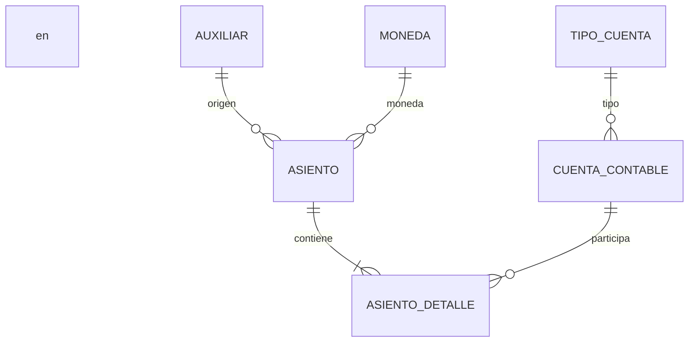

# 📊 Modelo de Datos y Lógica Contable

Esta guía detalla la estructura relacional de la base de datos y cómo los datos se clasifican para alimentar el Dashboard Central.

---

## 🗺️ Modelo ER (Entity-Relationship)

---

## 📄 Descripción de Entidades

### **1. Asiento (Journal Entry)**
Representa una transacción financiera completa.
*   **ID**: Generado automáticamente.
*   **Fecha**: Se asigna la fecha del servidor al momento de creación.
*   **Monto Total**: Suma de todos sus débitos (o créditos, al estar cuadrado).
*   **Estado**: `ACTIVO` por defecto.

### **2. Detalles de Asiento (Journal Entry Details)**
Son los renglones individuales de la transacción.
*   **Tipo Movimiento**: `Debito` o `Credito`. (Case sensitive).
*   **Monto**: Valor absoluto del movimiento.
*   **Cuenta**: Relación con la cuenta contable afectada.

### **3. Cuenta Contable (Account Catalog)**
Definición de las cuentas en el sistema.
*   **Código**: Estructura jerárquica (Ej: `110101`).
*   **Naturaleza**: `Deudora` o `Acreedora`.
*   **Estado**: `ACTIVO` o `INACTIVO`.

---

## 📈 Lógica del Dashboard (Agregación)

El Dashboard Administrativo consume el endpoint `/api/dashboard/stats/monthly` para generar las gráficas. La lógica de clasificación se basa en el **primer dígito** del código de la cuenta:

| Código Inicia con... | Clasificación | Impacto |
| :--- | :--- | :--- |
| **4** | **Ingresos** | Aumenta el balance positivo. |
| **5 o 6** | **Gastos** | Disminuye el balance positivo. |

### 🛠️ Ejemplo de Cálculo:
Si un asiento tiene un detalle de **Débito a la cuenta 401** por RD$ 50,000, el Dashboard lo sumará automáticamente a la gráfica de **"Ingresos"** del mes correspondiente.

---

## 🗺️ Catálogo de Catálogos (Tablas de Tipos)

*   **Monedas**: Tabla para gestionar divisas y sus tasas de cambio.
*   **Auxiliares**: Identificadores de los sistemas que envían datos (Nómina, Facturación, etc.).
*   **Tipos de Cuenta**: Clasificación mayor (Activos, Pasivos, Capital, etc.).

> [!IMPORTANT]
> **Integridad Referencial**: No se pueden eliminar cuentas, monedas o auxiliares que ya tengan asientos vinculados para garantizar la trazabilidad contable (Auditoría).
